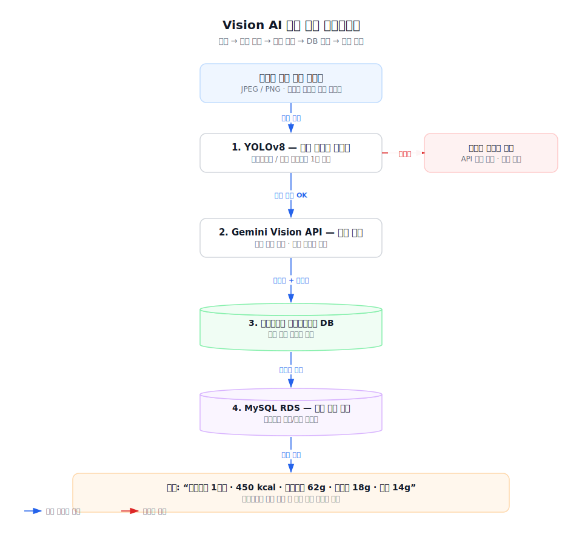
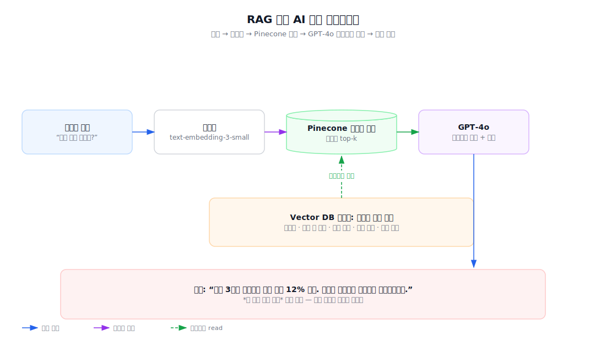
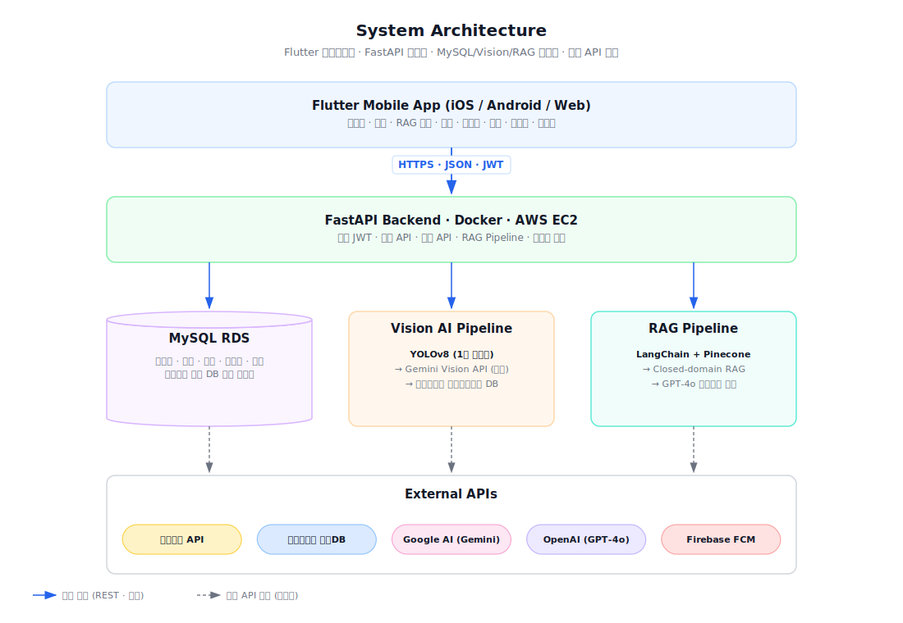

<div align="center">

# On-Care

### HealthMate AI: 불규칙한 생활 속 2030을 위한 고혈압·당뇨 위험군 대상 식단 인식·코칭 통합 헬스케어 플랫폼

[](https://flutter.dev)
[](https://fastapi.tiangolo.com)
[](https://github.com/ultralytics/ultralytics)
[](https://ai.google.dev)
[](https://openai.com)
[](#license)


</div>

---

## Why On-Care

> 2030 세대의 만성질환 유병률이 구조적으로 급증하고 있다. 그러나 시장의 헬스케어 앱들은 여전히 *기록의 번거로움*, *맥락 없는 획일적 조언*, *온·오프라인의 단절* 이라는 세 가지 한계를 벗어나지 못한다.

On-Care 는 이 세 가지 마찰을 정면으로 해결하기 위해 만들어진 **AI 헬스케어 플랫폼**입니다. 사진 한 장으로 식단을 자동 분석하고, 사용자의 모든 누적 이력을 RAG 로 참조하는 AI 코치가 *내 데이터를 아는* 맞춤 조언을 제공하며, 식단·운동·헬스장·일정·상담을 단일 앱에서 통합 제공합니다.

<br/>

## Problem

20~30대를 대상으로 한 국민건강보험공단·자체 사용자 인터뷰 결과, 다음의 다섯 가지 페인 포인트가 일관되게 관찰되었습니다.

| # | 페인 포인트 | 본질 |
|---|-------------|------|
| 1 | **수치적 위험은 급증, 도구는 정체** | 최근 5년 2030 당뇨 +38%, 고혈압 +28%. 그러나 기존 앱은 여전히 수동 검색 / 바코드 입력 방식. |
| 2 | **기록 → 행동 변화 단절** | 매끼 입력은 요구하지만, 누적 데이터 기반의 *맥락 있는* 피드백이 없어 사용자는 3일 안에 이탈. |
| 3 | **개인화 부재** | 칼로리 알림 수준. 만성질환자에게 진짜 필요한 건 *얼마나 먹었나* 가 아니라 *무엇을 피해야 하나*. |
| 4 | **다이어트 패러다임의 한계** | 시장 대부분이 체중 감량·소셜 챌린지 중심. 질환 관리에 부적합. |
| 5 | **온·오프라인 분리** | 트레이너·헬스장 연결이 없어 사용자가 앱 밖으로 이탈. 정보 흐름의 연속성 부재. |

**한 줄 요약** — 기존 헬스케어 앱은 *기록 중심 · 비개인화 · 파편화* 된 구조로 인해, 만성질환 위험군의 지속적 건강 관리와 실제 행동 변화를 만들어내지 못한다.

<br/>

## Solution

On-Care 는 위 다섯 가지 마찰을 다음의 네 가지 기술적 의사결정으로 제거합니다.

| 마찰 | On-Care 의 해법 |
|------|----------------|
| 기록의 번거로움 | **Vision AI 2-stage 파이프라인** — YOLOv8 음식 필터 + Gemini Vision 영양 분석 + 공공데이터 영양성분 DB 매핑 |
| 맥락 없는 조언 | **RAG 기반 AI 코치** — 사용자 인바디·식단·운동·질환 이력을 Pinecone 에 임베딩, GPT-4o 에 실시간 컨텍스트로 주입 |
| 질환 무관 설계 | **2030 고혈압·당뇨 위험군 도메인 특화** — 나트륨 추적·GI 분류·불규칙 식사 패턴 감지 |
| 온·오프라인 분리 | **O2O 통합** — 카카오맵 기반 헬스장 검색·예약, 트레이너 인앱 채팅, 건강 요약 자동 전달 |

**핵심 가치** — *기록 도구가 아닌, 행동 변화를 만드는 앱.*

<br/>

## Key Features

| 기능 | 설명 | 핵심 기술 |
|------|------|-----------|
| **Vision AI 식단 자동 인식** | 음식 사진 1장으로 식품 종류·섭취량·칼로리·영양소를 자동 분석 및 기록 | YOLOv8 (음식 필터링) · Gemini Vision API (영양 분석) · 공공데이터 식품영양성분 DB |
| **RAG 기반 AI 헬스 챗봇** | 사용자 건강 이력 Vector DB 를 GPT-4o 에 컨텍스트로 주입, 개인 맞춤 코칭 제공 | LangChain · Pinecone · GPT-4o |
| **AI 맞춤 운동 코칭** | 체력·목적·건강 상태 기반 운동 루틴 생성, 피드백 반영 동적 재조정 | LLM + 규칙 기반 하이브리드 |
| **헬스장 검색 & 트레이너 연동** | 위치 기반 검색·예약·트레이너 인앱 채팅, 건강 데이터 자동 요약 전달 | 카카오맵 API |
| **통합 건강 일정 관리** | 식단·운동·병원 예약·건강검진 캘린더 통합, 실시간 푸시 알림 | Firebase Cloud Messaging |
| **Streak 보상 시스템** | 활동 포인트·연속 달성 보상, 프리미엄 기능 교환 가능 | — |

<br/>

## Vision AI Pipeline

사진 한 장이 어떻게 영양 정보로 변환되는지:

<p align="center">
  
</p>

> **2-stage 구조의 핵심** — YOLOv8 로 음식 여부를 먼저 판별해 불필요한 Gemini 호출을 차단하고, 음식으로 확인된 이미지에 한해 Gemini Vision 으로 세밀한 영양 분석을 수행합니다. 결과는 그대로 사용하지 않고 공공데이터 식품영양성분 DB 와 매핑하여 한국 음식 정확도를 확보합니다.

<br/>

## RAG Pipeline

사용자의 질문이 어떻게 개인화된 답변으로 변환되는지:

<p align="center">
  
</p>

> 단순 일반 정보가 아닌 ***내 이번 주 기록 기준*** 맞춤 조언이 핵심 차별점입니다. 한국영양학회 등 공인 데이터만 인덱싱하는 Closed-domain RAG + 프롬프트 가드레일로 의료 행위 위험을 차단합니다.

<br/>

## System Architecture

<p align="center">
  
</p>

<br/>

## Tech Stack

**Mobile**


**Backend**


**AI / ML**


**Platform & APIs**


<br/>

## Competitive Analysis

기존 헬스케어 플랫폼의 공백을 정확히 공략합니다.

| 비교 항목 | 삼성헬스 | 필라이즈 | 밀리그램 / 인아웃 | **On-Care** |
| :--- | :--- | :--- | :--- | :--- |
| **식단 기록 방식** | 직접 검색 · 수동 입력 | 사진 기반 AI 인식 | 사진 저장 · 빠른 입력 위주 | **사진 1장 → YOLOv8 필터링 + Gemini Vision 분석 + 공공데이터 자동 매핑** |
| **한국 음식 정확도** | 보통 | 보통 | 낮음 (사용자 등록 의존) | **높음 (공공데이터 식품영양성분 DB 검증)** |
| **AI 코칭 방식** | 활동 데이터 단편 해석 | AI 코치 + 전문가 Q&A | 소셜·챌린지 동기부여 | **RAG 기반 누적 이력 실시간 참조 맥락 코칭** |
| **만성질환 특화** | 없음 (범용) | 일부 (혈당 연동 등) | 없음 (다이어트 중심) | **2030 고혈압·당뇨 위험군 도메인 특화** |
| **오프라인 연결** | 없음 | 없음 | 없음 | **헬스장 검색·예약·트레이너 채팅 + 건강 요약 자동 전달 (O2O)** |
| **플랫폼 독립성** | 갤럭시 생태계 종속 | iOS / Android | iOS / Android | **Flutter 단일 코드베이스 iOS / Android 동일 경험** |

세부 분석은 [`docs/competitive_analysis.md`](docs/competitive_analysis.md) 참조.

<br/>

<!--
## Roadmap

| Stage | 범위 | 상태 |
|------|------|------|
| **S0 · Ideation** | 사용자 인터뷰 · 시장 분석 · 도메인 검증 | ✅ |
| **S1 · Prototype** | React Web 프로토타입, 핵심 화면 플로우 검증 | ✅ |
| **S2 · Flutter MVP** | iOS / Android 단일 코드베이스 · 디자인 시스템 · 로컬 백엔드(Drift) | 🚧 진행 중 |
| **S3 · FastAPI Backend** | JWT 인증 · 식단/운동/일정 API · 컨테이너 배포 | 📅 예정 |
| **S4 · Vision AI Integration** | YOLOv8 필터 + Gemini Vision + 공공데이터 매핑 | 📅 예정 |
| **S5 · RAG Coach** | Pinecone 인덱스 · GPT-4o 컨텍스트 파이프라인 | 📅 예정 |
| **S6 · O2O & Gamification** | 카카오맵 헬스장 · 트레이너 채팅 · Streak 보상 | 📅 예정 |
| **S7 · Beta Release** | TestFlight · Play 내부 테스트 · CGM 연동 검토 | 📅 예정 |

<br/>


## Repository Structure

```
sudo-capstone-project/
├── frontend/flutter/           # Flutter 모바일/웹 앱 (iOS / Android / Web)
│   ├── lib/
│   │   ├── app/                # 라우팅 · 부트스트랩
│   │   ├── core/               # 네트워크 · 스토리지 · 에러 처리
│   │   ├── design_system/      # 토큰 · 위젯 · 차트
│   │   ├── features/           # 도메인별 (dashboard / diet / exercise / ...)
│   │   └── shared/             # 공통 위젯 · 서비스
│   └── test/                   # 단위 · 위젯 · golden 테스트
├── backend/                    # FastAPI 백엔드 (예정)
├── api/                        # API 명세 · OpenAPI 스키마 (예정)
├── docs/                       # 설계 문서 · 경쟁사 분석 · 아이데이션
└── README.md
```


<br/>
-->

## Team


|                                                         최지수                                                          |                                                            박서연                                                            |                                                           신수빈                                                           |
|:--------------------------------------------------------------------------------------------------------------------:|:-------------------------------------------------------------------------------------------------------------------------:|:-----------------------------------------------------------------------------------------------------------------------:|
| <br/> | <br/> | <br/> |
|                                         [@aJISUa](https://github.com/aJISUa)                                         |                                      [@seoyeon0516](https://github.com/seoyeon0516)                                       |                                       [@subin21cc](https://github.com/subin21cc)                                        |
|                                               Data Analyst & Back-end                                                |                                                     DevOps & Back-end                                                     |                                                     AI & Front-end                                                      |


<br/>

## License

본 저장소의 소스 코드와 디자인 자산은 별도 명시가 없는 한 모두 저작권자에게 귀속되며, 사전 서면 동의 없이 복제·배포·상업적 이용을 금합니다.

<br/>

---

<div align="center">

**2026 이화여자대학교 캡스톤디자인**

*Team 02 Sudo — Jisu Choi · Seoyeon Park · Subin Shin*

</div>
